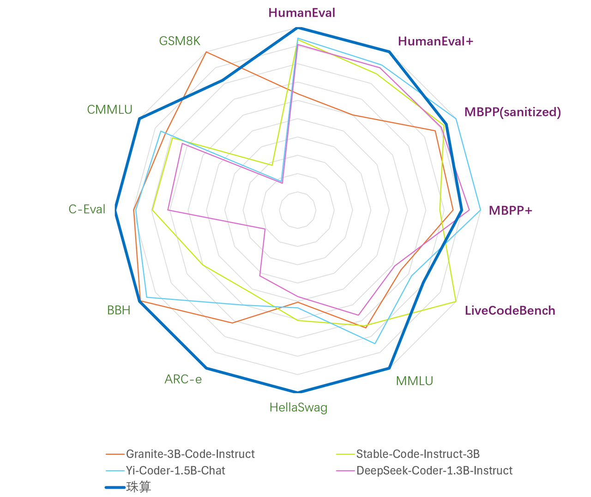
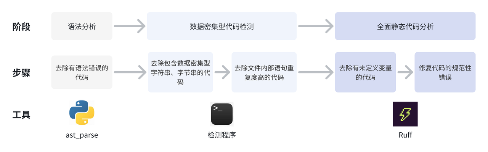
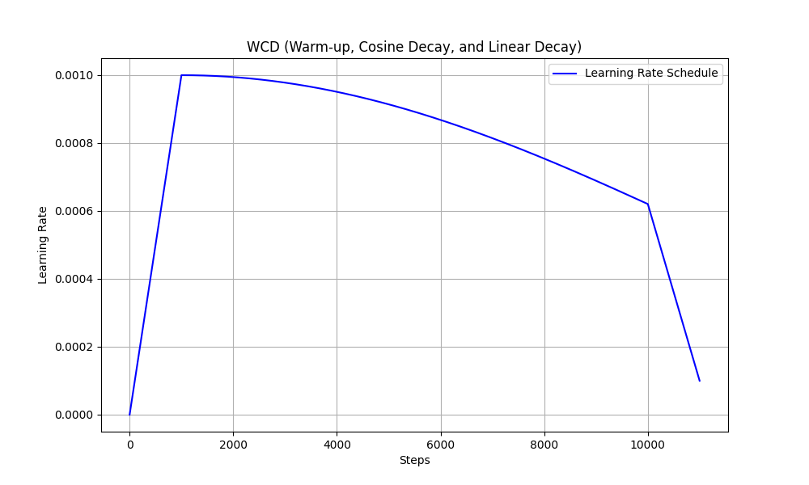
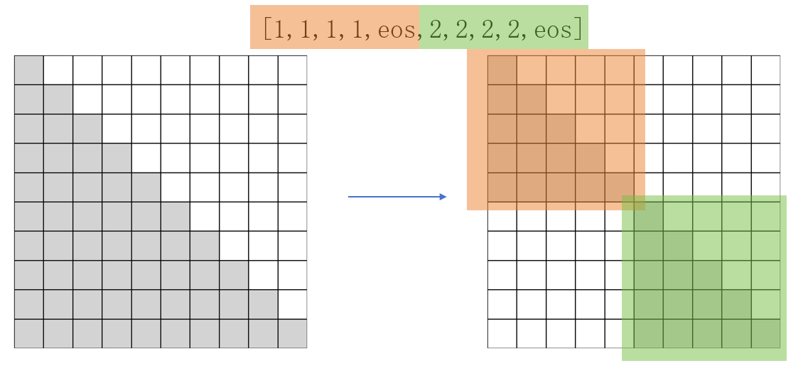

<!-- markdownlint-disable first-line-h1 -->
<!-- markdownlint-disable html -->
<!-- markdownlint-disable no-duplicate-header -->

  

  

  

---

- [模型介绍](#1.模型介绍)
- [模型下载](#2. 模型下载)
- [3. 模型评价结果](#3. 模型评价结果)
- [Cookbook](#cookbook)
- [Results](#results)
- [License](#license)

## 1.模型介绍
### 1.1 引言
​	从DeepMind发布的AlphaCode[1]在竞赛级编程能力上超越人类平均水平之日起，代码大模型便广受关注。与此同时，OpenAI发布的CodeX[2]更是展示出了代码大模型具有超越传统编程范畴的数值推理、逻辑推断、工具调用等高阶能力，进一步引爆了对该领域的研究与讨论。以BigCode StarCoder[3]为代表的开源项目对完善该领域的研究生态做出了卓越的贡献。然而，目前开源代码大模型提升编程能力的同时会严重损害通用语言能力。为此，哈尔滨工业大学社会计算与信息检索研究中心（HIT-SCIR）推出了“珠算”代码大模型，其以2.7B参数在代码与通用语言平均性能上均超越了DeepSeek-Coder-1.3B[4]、Yi-Coder-1.5B[5]、Stable Code-3B[6]、Granite-3B-Code[7]等参数量3B及以下的代码大模型，希望通过开放权重、训练细节以及配套的微调适配平台与插件，助力开源社区的发展。

  

- 3B以下最好的代码大模型
  
### 1.2 面向代码的继续预训练与微调
#### 预训练数据处理
- 代码数据：
  - step1: 借助抽象语法树（AST）分析代码的结构，去除存在低级语法错误与包含过时语法特性（如print “Hello World”，Python3解释器已不再支持）的代码.
  - step2: 提取了数据密集型代码(例如base64格式编码或长字符串）的特征并设计了正则表达式进行了针对性的过滤。
  - step3: 利用静态代码分析工具Ruff提供的漏洞检测与修复功能，去除了含有未定义变量错误的代码、修复了剩余代码的常见规范性错误（如多余的空行、空格）。
  - step4: 使用代码依赖分析按代码的逻辑结构合理地组织数据训练顺序。

  

- 通用语言数据：
  - step1: 使用Llama3.1-70B-Chat[12]对随机采样的2万个样本进行评分并使用评分结果训练了质量评估模型（准确率与召回率达95%），然后利用该模型对完整数据进行过滤。
  - step2: 从数据集中筛选出了Markdown与reStructureText格式的文件，这些格式的文件常为项目的说明文档或技术文档。然后，从中过滤出语言为中英文、包含Python代码块的文件。

#### 预训练策略
- 我们从MiniCPM-2B退火前的最后一个检查点开始继续预训练。学习率调度参照了WSD方法，即Warmup至一个较高的恒定学习率（称之为Stable阶段），用以搜索全局最优点，最后结合微调数据快速线性退火收敛至较低损失。其中，Stable阶段的恒定学习率设计主要为了便于随时接入新数据。在珠算大模型数据确定的场景下，我们观测到在该阶段缓慢降低学习率更有利于预训练数据的充分学习，因此应用了cosine学习率调度进行替换，形成WCL学习率调度（Warmup-Cosine-Linear）。学习率曲线如下图所示。

  

- 预训练数据组成：
  - Cosine Decay阶段的预训练数据由70%的代码数据、10%数学相关数据、20%的通用语言数据组成，共95B token。
  - Linear Decay阶段预训练与微调数据比例为7:3，预训练内部组成与Cosine阶段保持一致，微调内部代码与通用语言数据的比例为1:1，共7B token。
- 珠算大模型将packing策略（即将不同长度的样本拼接后整体作为一条训练数据）优化为了Block Attention Mask，将训练数据内部每个样本的注意力机制范围限制在自身，避免了样本间的污染，如下图所示。

  

#### 面向代码的微调
- 微调数据处理：我们提出了Semi-Instruct[13]，结合了Natural-Instruct（自动收集）和Self-Instruct（模型合成）两种方式。首先，通过类似Self-Instruct的方法，修复Natural-Instruct代码的规范性问题并补充缺失的指令。同时，生成测试用例的输入，利用原始代码的正确性，执行原始代码获得输出。然后，利用完整的测试样例验证新代码的正确性。最终，为去除不同来源的数据之间的重复样本，我们借助基于句子嵌入的SemDeDup[14]方法对数据整体进行了深层语义去重，确保了微调数据的多样性。
- 微调策略：为充分激发模型预训练阶段习得的能力，微调阶段的数据配比与超参数设置训练尽可能地与预训练退火阶段保持了对齐，以减小两者之间的差距。具体而言，微调数据量约80万条，共训练3个epoch。学习率（1.6e-4）、数据配比与退火阶段保持一致。数据来源上，Code数据主要来自一些高质量的开源Code数据，NL数据我们则使用了Infinity-Instruct-7M[15]数据中的Math、Commonsense和Subjective3个类别的数据。

## 2. 模型下载

|模型名称|文件大小|下载地址|备注|
|:---:|:---:|:---:|:---:|
|Abacus|5GB|[🤗HuggingFace](https://huggingface.co/HIT-SCIR/huozi3) [ModelScope](https://modelscope.cn/models/HIT-SCIR/huozi3/summary)|Abacus完整模型|

## 3. 模型评价结果

## 4. 模型推理
